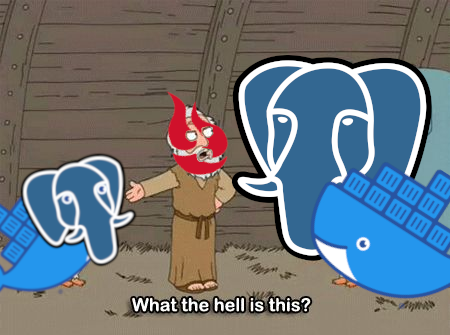

# poggres
postgres container w/ benefits

[postgresql](https://www.postgresql.org/) + [docker](https://www.docker.com/) + [backblaze b2](https://www.backblaze.com/b2/cloud-storage.html)


this is a customized postgresql docker image

it extends from the [official postgres docker image](https://hub.docker.com/_/postgres) but adds some benefits

it automatically
- sets up another db + user
- activates extensions
- dumps, encrypts and uploads backups

## building
```
BRANCH=$(git rev-parse --abbrev-ref HEAD)

docker build --rm -t napstr/poggres:$BRANCH .
docker push napstr/poggres:$BRANCH
```

## env vars

on top of the [existing env vars](https://hub.docker.com/_/postgres) the following ones are available:

```
ROLE                        unpriviledged user / role
PASSWORD                    password for the role
DB                          database belonging to the role
EXTENSIONS                  any additional extensions delimited by spaces

BACKUP_DB                   database to backup
BACKUP_APPNAME              name of the application to backup (meta information)
BACKUP_PASS                 password to encrypt the backup
BACKUP_BUCKET               b2 bucket for backups
BACKUP_APP_KEY_ID           b2 app key id (account id also works)
BACKUP_APP_KEY              b2 app key
```

optionally, if you want to backup to different buckets:
```
BACKUP_BUCKET_DAILY         b2 bucket for daily backups
BACKUP_BUCKET_WEEKLY        b2 bucket for weekly backups
BACKUP_BUCKET_MONTHLY       b2 bucket for monthly backups
```

## how to use

### docker-compose

simple
```yaml
services:
  dev-postgres:
    image: napstr/poggres:17
    restart: always
    ports:
      - 127.0.0.1:5442:5432
    environment:
      - POSTGRES_HOST_AUTH_METHOD=trust
      - DB=foo
      - ROLE=bar
      - EXTENSIONS=hstore
```

more stuff
```yaml
services:
  db:
    image: napstr/poggres:17
    restart: always
    ports:
      - 127.0.0.1:5432:5432
    volumes:
      - ./postgres-data/17/data:/var/lib/postgresql/data
    environment:
      - POSTGRES_PASSWORD=top_secret
      - DB=foo
      - ROLE=bar
      - PASSWORD=baz
      - EXTENSIONS=hstore lo pg_trgm
      - BACKUP_DB=foo
      - BACKUP_APPNAME=next-big-thing
      - BACKUP_PASS=top_secret
      - BACKUP_BUCKET=next-big-thing-backups
      - BACKUP_BUCKET_DAILY=next-big-thing-backups-daily
      - BACKUP_BUCKET_WEEKLY=next-big-thing-backups-weekly
      - BACKUP_BUCKET_MONTHLY=next-big-thing-backups-monthly
      - BACKUP_APP_KEY_ID=xyy
      - BACKUP_APP_KEY=yzz
```

### backups

#### schedule

backups are created daily, weekly and monthly. see [crontab](./crontab) for exact timings.

#### naming / buckets

backups are uploaded to b2. you can pick a single bucket or use different buckets for daily, weekly and monthly backups.
the filenames are prefixed with `daily`, `weekly` and `monthly` respectively so you can create lifecycle rules in b2 to delete old backups.

#### more

see [pg_b2_backup.sh](./pg_b2_backup.sh) for more details, such as how to decrypt and unpack them.
